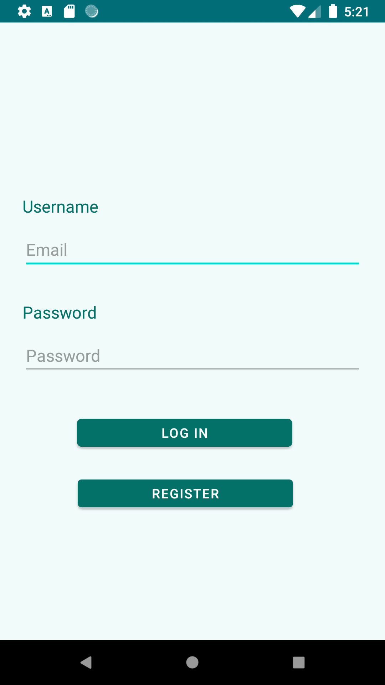
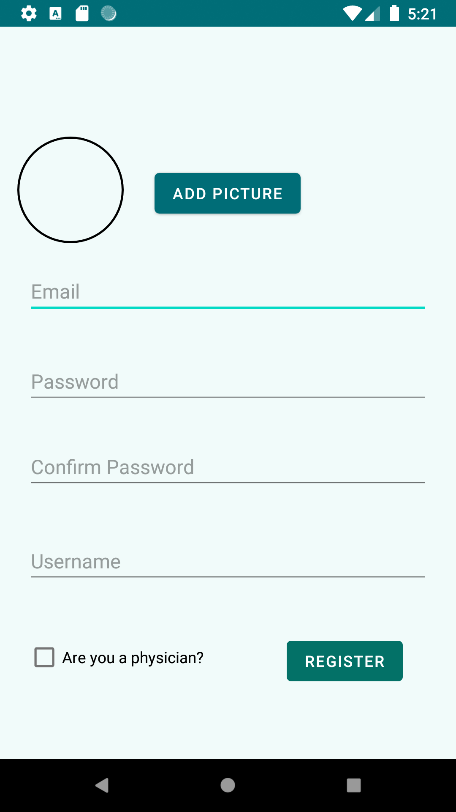
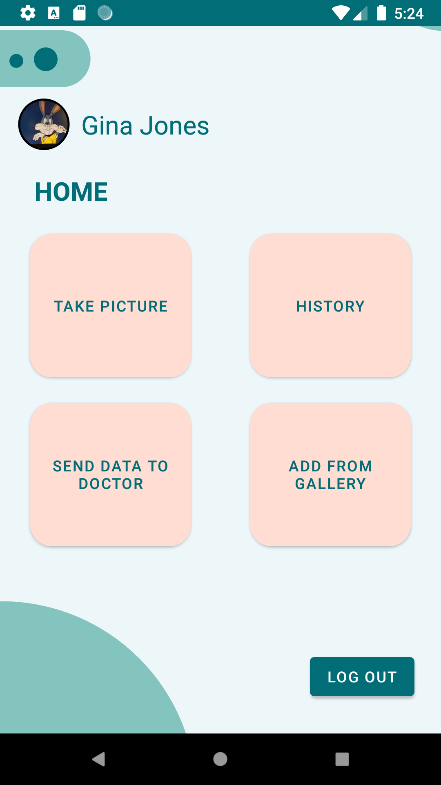
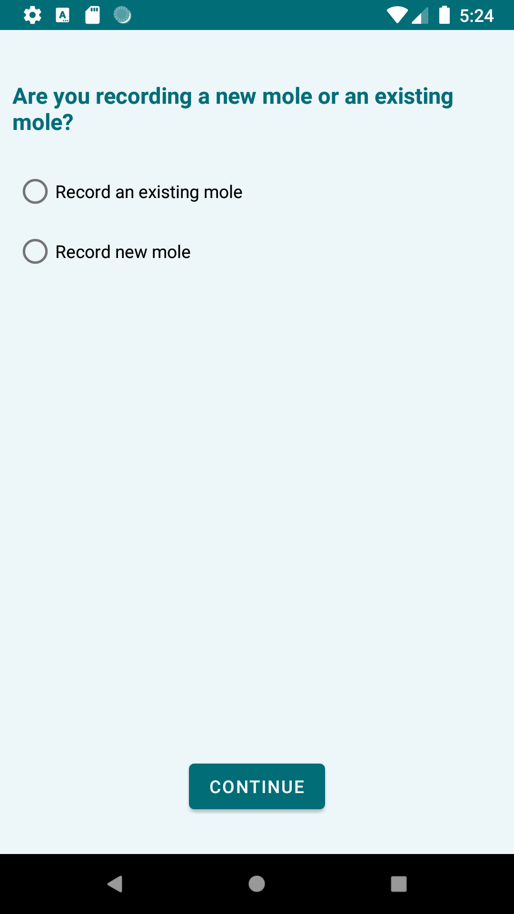
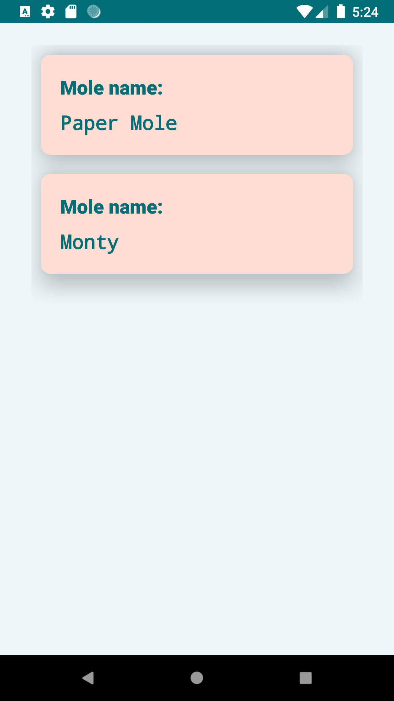
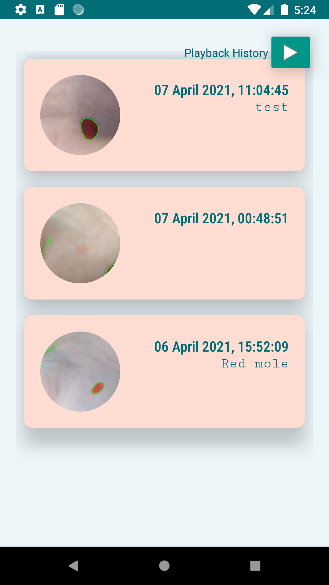
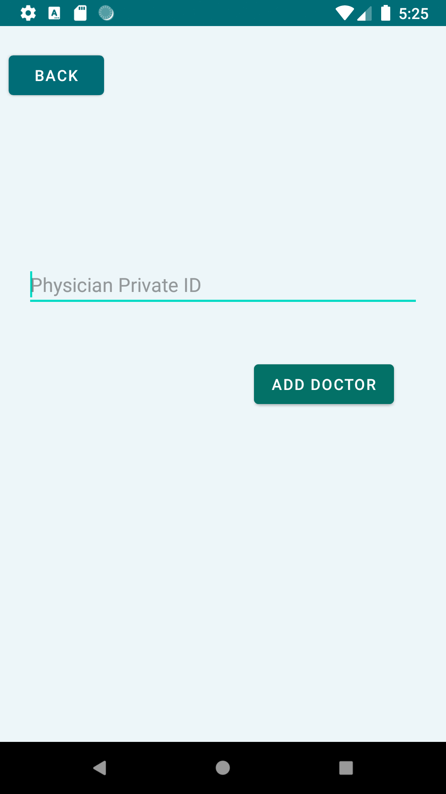

# ECE 1778 Track-A-Mole Project

  

The purpose of this Android application is to allow users to record and keep track of their moles. The application also uses OpenCV, an open source library for computer vision, to auto-generate some properties of the mole like it's size and whether or not it is symmetric. 

## User Guide

Users first have to create an account after which they can login to the application. This application uses a Firebase backend for user registration as well as for storing images.

  
  

Users can take a picture by selecting the "Take Picture" button. You can choose to start tracking a new mole or add a new entry for an existing mole. After taking a picture, the application asks for additional information about the mole (like symmetry, size, changes in colour). Some of these properties are auto-generated. 

  
  

You can also view previous moles that have been recorded by selecting the "History" option on the home screen. Select the mole you wish to view. Each entry can be selected individually, or you can choose to a view a timelapse to see how the mole may have changed over time. 

  
  

A physician code can also be entered that allows users to share their recorded moles with a physician who also uses the application. 

  

## Installation

After you clone the repo, open the folder using Android Studio. 
Run the application by going to Run -> Run 'app'. The application can be run through an emulator or you can also plug in your android device.

For more details and the full report, <href="https://www.eecg.utoronto.ca/~jayar/ece1778/download/trackamole.pdf"> click here</href>. 
